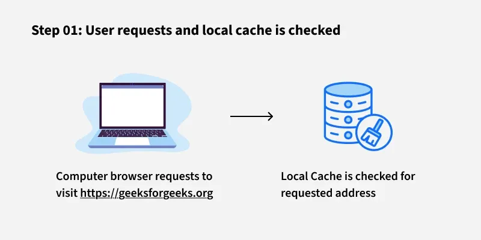
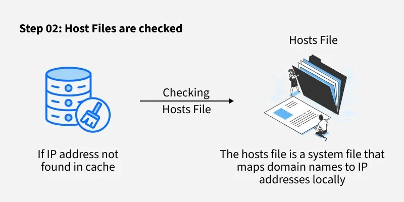
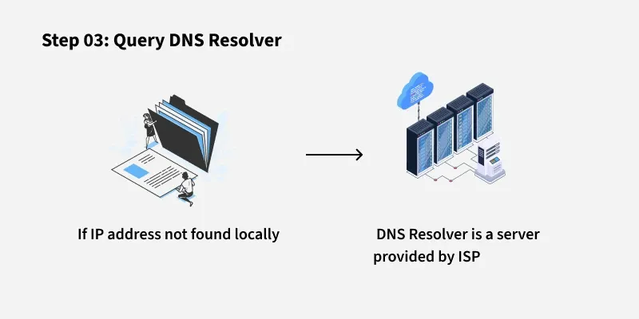
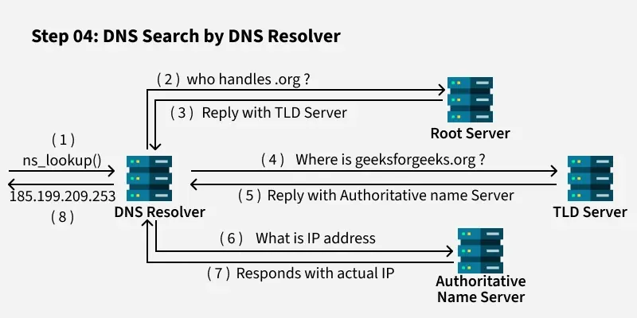
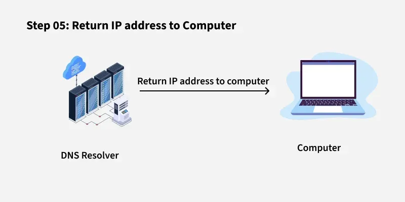
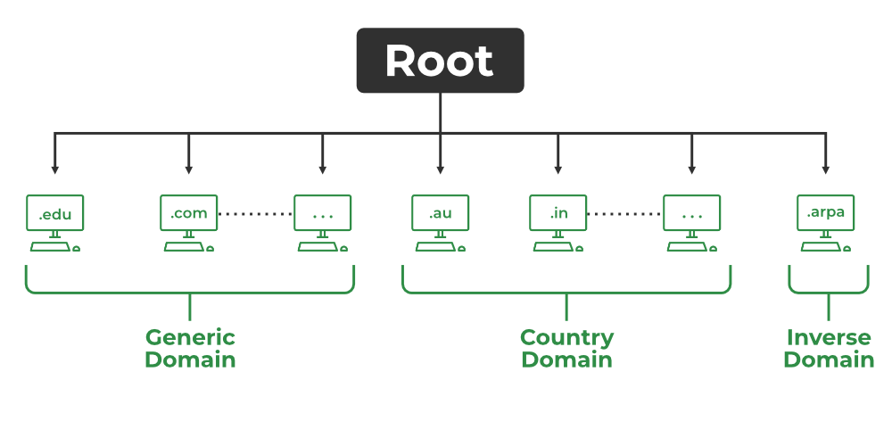

# what is DNS ?

*Domain Name System (DNS)*

DNS is a hierarchical and distributed naming system that translates domain names into IP addresses. When you type a domain name like www.geeksforgeeks.org into your browser, DNS ensures that the request reaches the correct server by resolving the domain to its corresponding IP address.

Without DNS, we’d have to remember the numerical IP address of every website we want to visit, which is highly impractical.

# How Does DNS Work?
The DNS process can be broken down into several steps, ensuring that users can access websites by simply typing a domain name into their browser.

1.User Input: You enter a website address (for example, www.geeksforgeeks.org) into your web browser.

2.Local Cache Check: Your browser first checks its local cache to see if it has recently looked up the domain. If it finds the corresponding IP address, it uses that directly without querying external servers.

3.DNS Resolver Query: If the IP address isn’t in the local cache, your computer sends a request to a DNS resolver. The resolver is typically provided by your Internet Service Provider (ISP) or your network settings.

4.Root DNS Server: The resolver sends the request to a root DNS server. The root server doesn’t know the exact IP address for www.geeksforgeeks.org but knows which Top-Level Domain (TLD) server to query based on the domain’s extension (e.g., .org).

5.TLD Server: The TLD server for .org directs the resolver to the authoritative DNS server for geeksforgeeks.org.

6.Authoritative DNS Server: This server holds the actual DNS records for geeksforgeeks.org, including the IP address of the website’s server. It sends this IP address back to the resolver.

7.Final Response: The DNS resolver sends the IP address to your computer, allowing it to connect to the website’s server and load the page.
**Note:** This entire process happens in milliseconds, enabling a fast and efficient browsing experience

## Parts of a Domain Name

**TLD (Top-Level Domain):**
The last part of a domain name, such as `.com`, `.org`, `.net`, etc. It represents the highest level in the domain name hierarchy. Example: In `example.com`, `.com` is the TLD.

**SLD (Second-Level Domain):**
The part directly before the TLD. It is usually the name chosen by the website owner. Example: In `example.com`, `example` is the SLD.

**Subdomain:**
A prefix added before the SLD and TLD, used to organize or separate sections of a website. Example: In `blog.example.com`, `blog` is the subdomain.

### Example Breakdown
For the domain `blog.example.com`:
- `com` is the TLD
- `example` is the SLD
- `blog` is the subdomain

# domens buying sites : 
1. https://www.godaddy.com/en-in
=======================================================================================================================