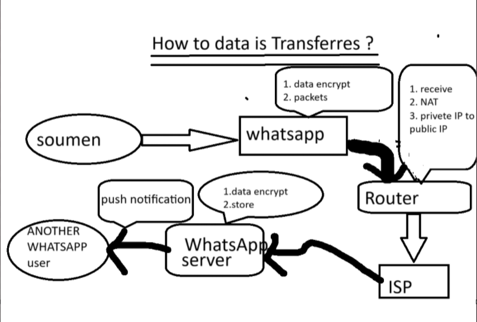

# How to data is transferred ?

### Explanation of the Image's Content (Step-by-Step)

The diagram illustrates the path and transformation of data when a user named "Soumen" sends a message.

1.  **Soumen to WhatsApp:** The process starts with the sender, "soumen," using the WhatsApp application.

2.  **WhatsApp App (Sender's Phone):** Before the message even leaves the phone, WhatsApp performs two key actions:
    * **1. Data Encrypt:** It encrypts the message. This is part of WhatsApp's "end-to-end encryption," meaning the message is scrambled so that only the sender and the intended recipient can read it. No one in between—not even WhatsApp—can see its content.
    * **2. Packets:** The encrypted message is broken down into smaller, manageable pieces of data called "packets." Sending data in packets is more efficient and reliable for network transmission.

3.  **Router:** The packets are then sent from the phone (likely via Wi-Fi) to the user's **Router**. The router is a critical device that manages the local network (your home or office) and connects it to the outside world. The diagram correctly notes its functions:
    * **1. Receive:** It receives the packets from the phone.
    * **2. NAT (Network Address Translation):** This is a crucial process. The phone has a **private IP address** that only works within your local network. The router performs NAT to assign its own **public IP address** to the packets. This public address is visible to the global internet and allows the packets to be routed correctly.
    * **3. Private IP to Public IP:** This point re-emphasizes the function of NAT.

4.  **ISP (Internet Service Provider):** The router sends the packets to the **ISP**. The ISP is the company that provides you with your internet connection (like Jio, Airtel, etc.). The ISP's network is the gateway that connects you to the rest of the internet.

5.  **WhatsApp Server:** The ISP routes the packets across the internet to their destination: the **WhatsApp server**. The diagram notes two actions the server takes:
    * **1. Data Encrypt:** This label is slightly misplaced. The data arrives at the server *already encrypted*. The server cannot read the message; it simply sees a block of encrypted data from one user intended for another.
    * **2. Store:** The server temporarily stores these encrypted packets. This is a "store and forward" model. The message waits on the server until the recipient is online and able to receive it.

6.  **Recipient ("ANOTHER WHATSAPP user"):**
    * **Push Notification:** To let the recipient know a message is waiting, the WhatsApp server sends a **push notification** to their device. This is the alert or banner you see on your phone screen.
    * When the recipient opens WhatsApp, their app connects to the server, downloads the encrypted packets, and their own WhatsApp application uses a unique security key to decrypt and reassemble the message so it can be read.

### What the Picture is Trying to Explain

The main goal of this diagram is to visualize **the fundamental flow of data across the internet**, using a common application like WhatsApp as an example. It successfully explains several key networking and security concepts:

* **Data Encryption:** Highlighting that security and privacy are the first step.
* **Packet Switching:** The method by which all data travels on the internet.
* **Local vs. Global Networks:** The role of the router and NAT in bridging a private home network with the public internet.
* **The Role of an ISP:** Showing that the ISP is the essential link to the global network.
* **Client-Server Architecture:** Demonstrating how our devices (clients) communicate with a central server (WhatsApp's server) to exchange information.